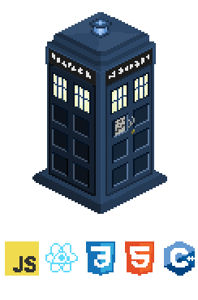

<h1 align="center">👋 Olá, eu sou o Lucas 👋

###

  <h3 align="center">📊 Github Stats</h3>

  

      
    
  

###

 

<h1></h1>

  <picture>
    <source media="(prefers-color-scheme: dark)" srcset="https://raw.githubusercontent.com/LuscaP3/LuscaP3/output/pacman-contribution-graph-dark.svg">
    <source media="(prefers-color-scheme: light)" srcset="https://raw.githubusercontent.com/LuscaP3/LuscaP3/output/pacman-contribution-graph.svg">
    
  </picture>

<h1></h1>

###
